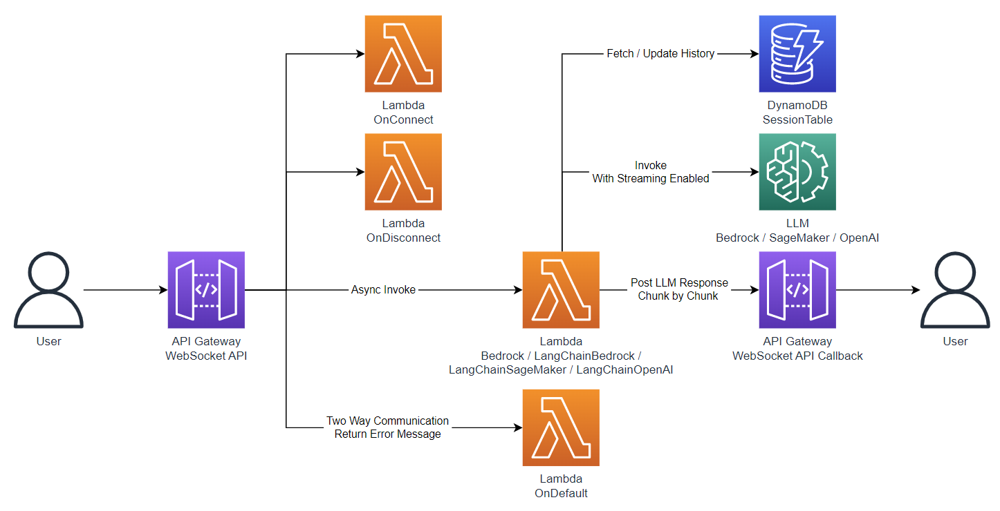

# sam-chat-boilerplate

[](https://github.com/DiscreteTom/sam-chat-boilerplate/releases/latest)

Take this project as the starting point of your serverless LLM chat application on AWS.

> [!NOTE]
> This project is **_NOT_** a production ready "solution". It is a boilerplate for you to start your own project. You should fork/clone and customize it to fit your own use case.

## Features

- Multiple LLM providers supported:
  - Amazon Bedrock.
  - Amazon SageMaker endpoints.
  - OpenAI compatible endpoints.
- LangChain integration in Lambda functions.
- Serverless, auto scaling, pay-per-use, no infrastructure to manage.

## [How to Deploy](./sam-app/README.md)

## How to Use

After the deployment, you will get a WebSocket API endpoint. Connect to that endpoint, and send the following JSON message to start the conversation:

```jsonc
// call Amazon Bedrock without langchain
{ "action": "bedrock", "input": "..." }

// call Amazon Bedrock with langchain
{ "action": "langchain/bedrock", "input": "..." }

// call Amazon SageMaker endpoint with langchain
{ "action": "langchain/sagemaker", "input": "..." }

// call OpenAI endpoint with langchain
{ "action": "langchain/openai", "input": "..." }
```

## Architecture



- API Gateway WebSocket API for real-time two-way communication between client and server.
- OnConnect / OnDisconnect Lambda functions to manage connections.
- LLM Lambda functions to fetch and update chat history from DynamoDB, call LLM providers with streaming response (and optional LangChain integration), and send the response back to client chunk by chunk.
- OnDefault Lambda function to handle unknown action.

### FAQ

- Why API Gateway WebSocket API instead of Lambda Response Streaming?
  - API Gateway has many useful features for production use cases, such as throttling, API key, authorizer, etc.
- Why the LLM Lambda functions are invoked asynchronously?
  - To avoid the 29 seconds timeout limit of API Gateway WebSocket API integration.

## Next Step

Since this project is a boilerplate, we want to keep it simple and focus on the serverless integrations, you should customize it to fit your own use case. Here are some suggestions:

- Add user management, LLM persona management, etc.
- Add authentication and authorization.
- Apply throttling, API key, etc.
- Add observability components, such as AWS X-Ray, CloudWatch Lambda Insights, etc.
- Remove unused Lambda functions and API Gateway routes.

## [CHANGELOG](./CHANGELOG.md)
